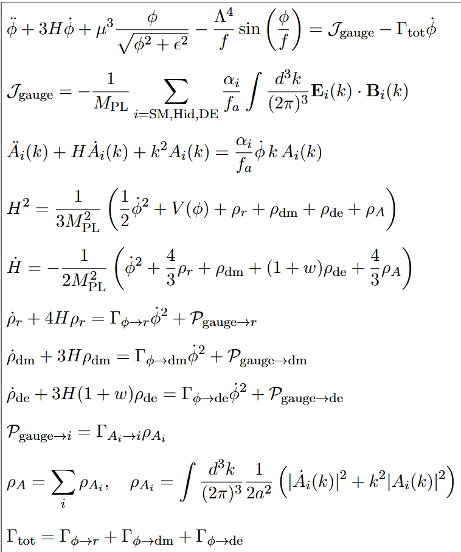

# Axion Monodromy Cosmic Evolution Simulation

A Python simulation of cosmic inflation and reheating using axion monodromy from Type IIB string theory, evolving the universe from inflation through dark energy domination.

##  Overview

This code implements a comprehensive cosmological model where an axion field serves as:
- **The inflaton** driving exponential expansion
- **The reheating source** decaying into Standard Model particles
- **The origin** of dark matter and evolving dark energy
- **The mechanism** for matter-antimatter asymmetry

Based on top-down string theory derivations, the simulation tracks the coupled evolution of the axion field, gauge fields, and cosmological energy components.

##  Physical System

The simulation solves this coupled system of equations:

## Features

- **Full coupled system**: Axion field, gauge fields, and cosmological fluids
- **String theory parameters**: Derived from Type IIB compactification
- **DESI-inspired dark energy**: Time-varying equation of state w(a)
- **Gauge field production**: With backreaction on inflation
- **Multi-sector reheating**: Decay to SM, dark matter, and dark energy
- **CP violation**: For matter-antimatter asymmetry

